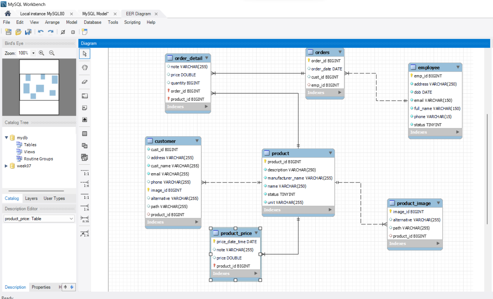
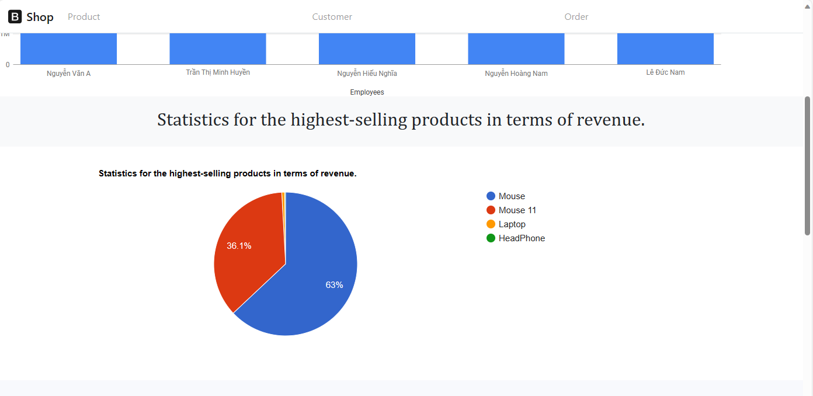
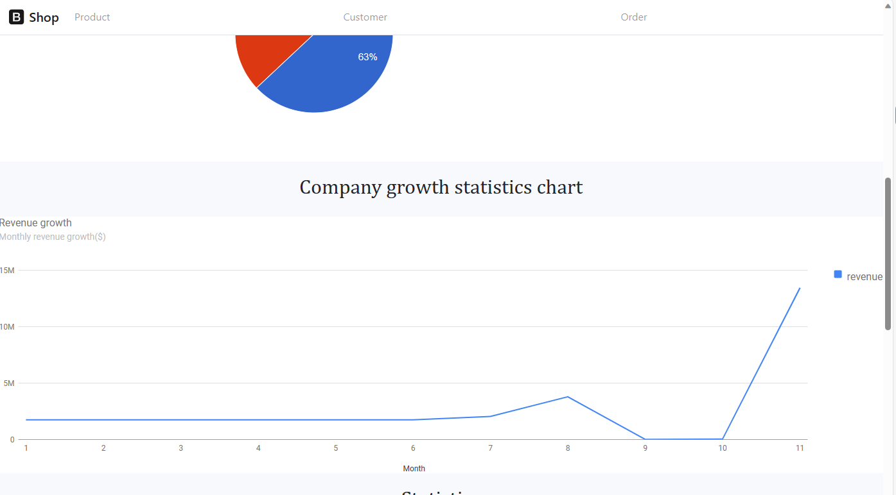

## TranThiMinhHuyen_20105231_WWW_WEEK7

# Rule
This website serves as a comprehensive platform for both sales and inventory management, comprising two main components:

E-commerce Interface: Customers can effortlessly navigate the sales website, peruse available products, and seamlessly place orders based on their preferences.

Administrative Dashboard: Tailored for administrators, this feature empowers them to create and manage administrative accounts for their team. The dashboard facilitates meticulous control over the sales website, allowing administrators to execute vital functions such as product inventory management, customer relations oversight, order approval, and performance evaluation. Administrators can gain insights into employee productivity, identify high-performing staff, and monitor the company's sales growth trajectory.
# Database diagram

# UI
1. The administrator logs into the system.
    
2. The administrator has the capability to add, delete, and modify products.
    
    
    
    
    
    
    
    
    
    
    
    
3. When returning to the customer's page, one can observe that the products are displayed.
    
    
4. Customers can add their selected products to the shopping cart. When ready to proceed with payment, they will be prompted to provide complete information. Once the required information is entered, customers can finalize the product purchase. Additionally, customers have the option to update their information by selecting the 'Customer Information' menu.
    
    
    
    
    
    
    
    
    
5. When a customer has successfully placed an order and returns to the Administration page, the administrator will see a pending order, which can then be approved by the administrator.
    
    
    
6. At the administration homepage, there will be statistics regarding the sales productivity of employees and the company's growth rate over time.
- Statistics of total revenue of each employee
    
- Statistics for the highest-selling products 
in terms of revenue
    
- Company growth statistics chart by time

- Product statistics chart over time period
  
- Order statistics chart for each employees
    
7. Here, administrators also have the authority to add, view, delete, and modify employees, with these privileges exclusively granted to administrators.
    
    
    
    